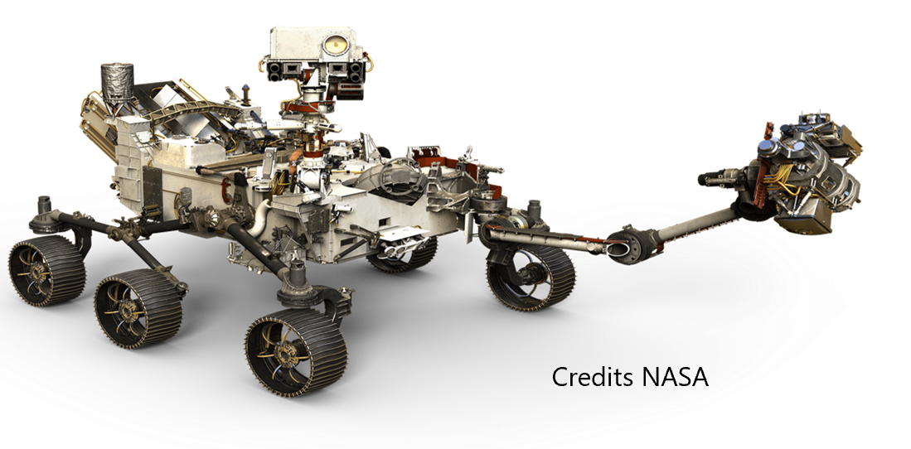
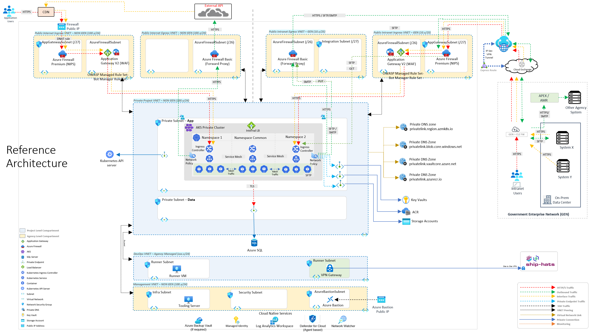

# caf-terraform-gcc-starter-kit
caf terraform accelerator kit for public sector


<!-- BADGES -->


<br />

<!-- PROJECT LOGO -->
<p align="center">
    
</p>

<!-- TABLE OF CONTENTS -->
## Table of Contents

* [About the Project](#about-the-project)
  * [Features](#features)
  * [Built With](#built-with)
  * [Overview Architecture](#architecture)
  * [Frontend](#frontend)
  * [Backend](#backend)
* [Getting Started](#getting-started)
  * [Prerequisites](#prerequisites)
  * [Branch](#branch)
* [Versioning](#versioning)
* [License](#license)
* [Contact](#contact)

<!-- ABOUT THE PROJECT -->
## About The Project

The purpose of the "AZURE GCC Acceleration Kit" is to facilitate the workload setup in AZURE environment. This will be achieved in a two-step layered approach.  
<p align="center">
    
</p>

<p align="center">
    
</p>


### Tested - 15 Nov 2023
CAF Rover: version rover:1.6.0-rc1-2310.0211 <br/>
Azurerm: version 3.80 <br/>
CAF Terraform: version 5.76 <br/>
aztfmod/azurecaf: 1.2.0 <br/>

Version: 0.1-1.6.0-5.76-3.80 (0.1-[rover version]-[caf terraform version]-[azurerm version])

### Features


#### Public Segment

Internet Ingress
- [x] Ingress Fiewall
- [x] Egress Firewall
- [x] Ingress Application Gateway with WAF

Intranet Ingress
- [x] Ingress Fiewall
- [x] Egress Firewall
- [x] Ingress Application Gateway with WAF

#### Private Segment

Project compartment
- [x] AKS private cluster
- [x] Azure Container Registry + private endpoint
- [x] APIM stsv2 vnet injection
- [x] App Service + vnet injection + private endpoint
- [x] Container Instance 
- [x] Open AI Service + private endpoint
- [x] Cognitive Search Service + private endpoint
- [x] Cosmos DB + private endpoint
- [x] SQL Server + private endpoint

Management Compartment
- [x] Bastion Host
- [x] Tooling Windows Server

DevOps Compartment
- [x] Runner Container Instance
- [ ] VPN Gateway


### Work In Progress

- [ ] Acceleration Kit UI 
- [ ] Integration with GitHub
- [ ] One Click deployment

### Built With

- CAF Terraform
- CAF Rover
- Terraform
- Ansible
- Jinja2 template

### Architecture

This section aims to give the reader an overview of GCC Starter architecture
<!-- , relative to external systems and in terms of how the codebase is organised. -->

#### Overview Architecture

<p align="center">
  
</p>

### Frontend

WIP

### Backend

WIP

<!-- GETTING STARTED -->
## Getting Started

To get a local copy up and running follow these simple steps below.

### Prerequisites

In order to start deploying your environments with CAF landing zones, you need an Azure subscription (Trial, MSDN, etc.) and you need to install the following components on your machine:
* Visual Studio Code
* Docker Desktop or Rancher Desktop in dockerd mode.
* Git
<br/><br/>
#### Git Clone the Repo
```bash
git clone https://github.com/mspsdi/caf-terraform-gcc-starter-kit
```
* Open working folder with Visual Studio Code (Note: Reopen in container when prompt in VS Code)
  * (if required) Install VS Code Extension - Dev Containers
* Add a zsh terminal from VS Code
* Follow the steps in README.md file

<!--
Before you can start running the project, below are tools that you will need to install in your development computers.

* Install [Python](https://www.python.org/downloads/), [Node.js](https://nodejs.org/en/download/), [Git](https://git-scm.com/downloads), [Azure CLI](https://learn.microsoft.com/en-us/cli/azure/install-azure-cli) and [Azure Function CLI](https://learn.microsoft.com/en-us/azure/azure-functions/functions-run-local?tabs=macos%2Cisolated-process%2Cnode-v4%2Cpython-v2%2Chttp-trigger%2Ccontainer-apps&pivots=programming-language-csharp)

* Setup 
    * a [Microsoft Azure Account](https://azure.microsoft.com/en-us/) to build, manage, and monitor your cloud applications and manage your account and billing through the Azure portal.

* Good understanding of Storyboard. 
  - As the Cloud Evidence Platform follows a DevOps lifecycle, I develop based on project backlog.

* Good Knowledge on [Azure Fundamentals](https://docs.microsoft.com/en-us/azure/?product=featured).

-->

### Deployment

Recommend Internet CIDR Range: 100.64.0.0/10

#### Login to Azure
```bash
az login --tenant {{tenant id}} # azure tenant id

az account set --subscription xxxxxxxx-xxxxxx-xxxx-xxxx-xxxxxxxxxxxx # subscription id
```
Or
```bash
rover login

az account set --subscription xxxxxxxx-xxxxxx-xxxx-xxxx-xxxxxxxxxxxx # subscription id
```


#### A. Ignite - code generator

#### A1. edit the below configuration files


/tf/caf/definition/config_application.yaml<br/>
/tf/caf/definition/config_gcc.yaml<br/>
/tf/caf/definition/config_solution_accelerators.yaml


#### check prefix and subscription id

#### A2. execute rover ignite to generate the caf terraform tfvars file
```bash
cd /tf/caf/ansible
rover ignite --playbook /tf/caf/ansible/gcc-starter-playbook.yml
sudo chmod -R -f 777 /tf/caf/{{gcc_starter_project_folder}}
cd /tf/caf
```

To continue, goto README.md file 
/tf/caf/{{gcc_starter_project_folder}}/README.md

#### B. Begin CAF Terraform for GCC

##### Preparation - GCC simulator environment ** OPTIONAL


OPTIONAL - create development environment (only for your own test environment)
go to /tf/caf/{{gcc_starter_project_folder}}/gcc-dev-env/README.md


#### 1. level 0 - launchpad

1.1. launchpad - /tf/caf/{{gcc_starter_project_folder}}/landingzone/configuration/level0/launchpad
```bash
rover -lz /tf/caf/landingzones/caf_launchpad \
  -launchpad \
  -var-folder /tf/caf/{{gcc_starter_project_folder}}/landingzone/configuration/level0/launchpad \
  -env {{caf_environment}} \
  -skip-permission-check \
  -a plan
```

#### 2. level 3 - networking


2.1. level 3 - shared services - /tf/caf/{{gcc_starter_project_folder}}/landingzone/configuration/level3/shared_services
```bash
rover -lz rover -lz /tf/caf/landingzones/caf_solution \
  -level level3 \
  -var-folder /tf/caf/{{gcc_starter_project_folder}}/landingzone/configuration/level3/shared_services \
  -parallelism 30 \
  -env {{caf_environment}} \
  -skip-permission-check \
  -tfstate shared_services.tfstate \
  -a plan
```

2.2. level 3 - management - /tf/caf/{{gcc_starter_project_folder}}/landingzone/configuration/level3/networking_spoke_management
```
rover -lz rover -lz /tf/caf/landingzones/caf_solution \
-level level3 \
-var-folder /tf/caf/{{gcc_starter_project_folder}}/landingzone/configuration/level3/networking_spoke_management \
-parallelism 30 \
-env {{caf_environment}} \
-tfstate networking_spoke_management.tfstate \
-a plan
```

2.3. level 3 - devops - /tf/caf/{{gcc_starter_project_folder}}/landingzone/configuration/level3/networking_spoke_devops
```bash
rover -lz /tf/caf/landingzones/caf_solution \
-level level3 \
-var-folder /tf/caf/{{gcc_starter_project_folder}}/landingzone/configuration/level3/networking_spoke_devops \
-parallelism 30 \
-env {{caf_environment}} \
-tfstate networking_spoke_devops.tfstate \
-a plan
```

2.4. level 3 - hub internet - /tf/caf/{{gcc_starter_project_folder}}/landingzone/configuration/level3/networking_hub_internet
```bash
rover -lz rover -lz /tf/caf/landingzones/caf_solution \
-level level3 \
-var-folder /tf/caf/{{gcc_starter_project_folder}}/landingzone/configuration/level3/networking_hub_internet \
-env {{caf_environment}} \
-tfstate networking_hub_internet.tfstate \
-a plan
```

2.5. level 3 - hub intranet - /tf/caf/{{gcc_starter_project_folder}}/landingzone/configuration/level3/networking_hub_intranet
```bash
rover -lz rover -lz /tf/caf/landingzones/caf_solution \
-level level3 \
-var-folder /tf/caf/{{gcc_starter_project_folder}}/landingzone/configuration/level3/networking_hub_intranet \
-env {{caf_environment}} \
-tfstate networking_hub_intranet.tfstate \
-a plan
```

2.6. level 3 - spoke project - /tf/caf/{{gcc_starter_project_folder}}/landingzone/configuration/level3/networking_spoke_internet
```bash
rover -lz rover -lz /tf/caf/landingzones/caf_solution \
-level level3 \
-var-folder /tf/caf/{{gcc_starter_project_folder}}/landingzone/configuration/level3/networking_spoke_internet \
-env {{caf_environment}} \
-tfstate networking_spoke_internet.tfstate \
-a plan
```

2.7. level 3 - vnet peering - /tf/caf/ansible/templates/configuration/level3/networking_vnet_peering
```bash
rover -lz rover -lz /tf/caf/landingzones/caf_solution \
-level level3 \
-var-folder /tf/caf/{{gcc_starter_project_folder}}/landingzone/configuration/level3/networking_vnet_peering \
-parallelism 30 \
-env {{caf_environment}} \
-tfstate networking_vnet_peering.tfstate \
-a plan
```

#### firewall, application gateway

2.8. egress firewall internet
```bash
rover -lz rover -lz /tf/caf/landingzones/caf_solution \
-level level3 \
-var-folder /tf/caf/{{gcc_starter_project_folder}}/landingzone/configuration/level3/egress_internet/firewall \
-parallelism 30 \
-env {{caf_environment}} \
-tfstate networking_firewall_egress_internet.tfstate \
-a apply
```

2.9. egress firewall intranet
```bash
rover -lz rover -lz /tf/caf/landingzones/caf_solution \
-level level3 \
-var-folder /tf/caf/{{gcc_starter_project_folder}}/landingzone/configuration/level3/egress_intranet/firewall \
-parallelism 30 \
-env {{caf_environment}} \
-tfstate networking_firewall_egress_intranet.tfstate \
-a apply
```

2.10. agw internet
```bash
rover -lz rover -lz /tf/caf/landingzones/caf_solution \
-level level3 \
-var-folder /tf/caf/{{gcc_starter_project_folder}}/landingzone/configuration/level3/ingress_internet/agw \
-env {{caf_environment}} \
-tfstate solution_accelerators_agw_internet_ssl.tfstate \
-a apply
```

2.11. agw intranet
```bash
rover -lz rover -lz /tf/caf/landingzones/caf_solution \
-level level3 \
-var-folder /tf/caf/{{gcc_starter_project_folder}}/landingzone/configuration/level3/ingress_intranet/agw \
-env {{caf_environment}} \
-tfstate solution_accelerators_agw_intranet_ssl.tfstate \
-a apply
```

2.12. ingress firewall internet
```bash
rover -lz rover -lz /tf/caf/landingzones/caf_solution \
-level level3 \
-var-folder /tf/caf/{{gcc_starter_project_folder}}/landingzone/configuration/level3/ingress_internet/firewall \
-parallelism 30 \
-env {{caf_environment}} \
-tfstate networking_firewall_ingress_internet.tfstate \
-a apply
```

2.13. ingress firewall intranet
```bash
rover -lz rover -lz /tf/caf/landingzones/caf_solution \
-level level3 \
-var-folder /tf/caf/{{gcc_starter_project_folder}}/landingzone/configuration/level3/ingress_intranet/firewall \
-parallelism 30 \
-env {{caf_environment}} \
-tfstate networking_firewall_ingress_intranet.tfstate \
-a apply
```

#### 3. level 4 - solution accelerators

##### DevOps, Management Zone

* Management bastion host and tooling server
```bash
rover -lz rover -lz /tf/caf/landingzones/caf_solution \
-level level4 \
-var-folder /tf/caf/{{gcc_starter_project_folder}}/landingzone/configuration/level4/management \
-parallelism 30 \
-env {{caf_environment}} \
-tfstate solution_accelerators_management.tfstate \
-a apply
```

* devops runner vm or container instances
```bash
rover -lz rover -lz /tf/caf/landingzones/caf_solution \
-level level4 \
-var-folder /tf/caf/{{gcc_starter_project_folder}}/landingzone/configuration/level4/devops \
-parallelism 30 \
-env {{caf_environment}} \
-tfstate solution_accelerators_devops.tfstate \
-a apply
```

##### Project


* sql server
```bash
rover -lz rover -lz /tf/caf/landingzones/caf_solution \
-level level4 \
-var-folder /tf/caf/{{gcc_starter_project_folder}}/landingzone/configuration/level4/project/mssql \
-env {{caf_environment}} \
-tfstate solution_accelerators_mssql.tfstate \
-a apply
```



* storage account
```bash
rover -lz rover -lz /tf/caf/landingzones/caf_solution \
-level level4 \
-var-folder /tf/caf/caf_terraform_starter_osscuat_uat/landingzone/configuration/level4/project/storage_account \
-env uat \
-tfstate solution_accelerators_storage_account.tfstate \
-a apply
```



* key vault
```bash
rover -lz rover -lz /tf/caf/landingzones/caf_solution \
-level level4 \
-var-folder /tf/caf/caf_terraform_starter_osscuat_uat/landingzone/configuration/level4/project/keyvault \
-env uat \
-tfstate solution_accelerators_keyvault.tfstate \
-a apply
```



* app_service
```bash
rover -lz rover -lz /tf/caf/landingzones/caf_solution \
-level level4 \
-var-folder /tf/caf/caf_terraform_starter_osscuat_uat/landingzone/configuration/level4/project/app_service \
-env uat \
-tfstate solution_accelerators_app_service.tfstate \
-a apply
```



* cosmo db
```bash
rover -lz rover -lz /tf/caf/landingzones/caf_solution \
-level level4 \
-var-folder /tf/caf/{{gcc_starter_project_folder}}/landingzone/configuration/level4/project/cosmosdb \
-env {{caf_environment}} \
-tfstate solution_accelerators_cosmosdb.tfstate \
-a apply
```



* aks and acr
```bash
rover -lz rover -lz /tf/caf/landingzones/caf_solution \
-level level4 \
-var-folder /tf/caf/{{gcc_starter_project_folder}}/landingzone/configuration/level4/project/aks \
-env {{caf_environment}} \
-tfstate solution_accelerators_aks.tfstate \
-a apply
```



#### 4. Testing

4.1. ** OPTIONAL: deploy sample azure-vote application and validation through internet and intranet

4.2. add deny all to app nsg and web nsg

cd /tf/caf/ansible/templates/scripts
../level3_networking.sh

4.3. sql server admin password
Goto keyvault {{project_code}}-kv-mssql secrets to retrieve your sql server admin password


### Branch

#### develop

The develop branch is for testing and staging of all new features, fixes and tests. 
<!-- When the develop branch is stable and functional in the Azure staging-environment `func azure functionapp publish cep-xxx-staging-fx`, we publish the Functions project into Azure for production `func azure functionapp publish cep-xxx-prod-fx`.
-->

<!-- VERSIONING -->
## Versioning

We follow [semantic versioning](https://semver.org/) for all of our builds.

<!-- LICENSE -->
## License

This project is licensed under the [MIT license](#LICENSE.md).

## Troubleshooting Tips

ERROR: dial tcp: lookup management.azure.com on 127.0.0.11:53: no such host<br/>
Resolution: re-run the rover apply command
edit /etc/resolv.conf - Add the dns settings "8.8.8.8" from your host machine at the top of resolv.conf
nameserver 8.8.8.8
options ndots:0

ERROR: server misbehaving <br/>
Resolution: edit /etc/resolv.conf - Add the dns settings "8.8.8.8" from your host machine at the top of resolv.conf
nameserver 8.8.8.8
options ndots:0

ERROR: Terraform plan return code: 1
Error 1 on or near line 57: Error running terraform plan; exiting with status 1
Resolution: re-run the rover apply command


