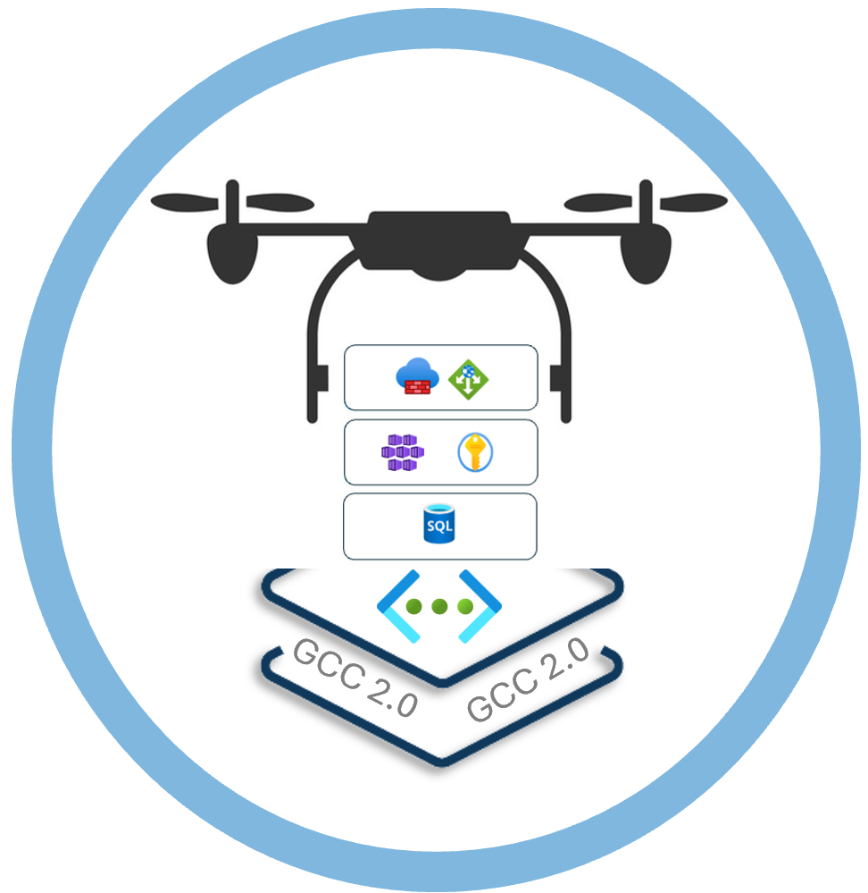

# caf-terraform-gcc-starter-kit
caf terraform accelerator kit for GCC 2.0


<!-- BADGES -->
<!--

-->
<br />

<!-- PROJECT LOGO -->
<p align="center">
    
</p>

<!-- TABLE OF CONTENTS -->
## Table of Contents

* [About the Project](#about-the-project)
  * [Features](#features)
  * [Built With](#built-with)
  * [Overview Architecture](#architecture)
  * [Frontend](#frontend)
  * [Backend](#backend)
* [Getting Started](#getting-started)
  * [Prerequisites](#prerequisites)
  * [Deployment](#deployment)
  * [Branch](#branch)
* [Versioning](#versioning)
* [License](#license)
* [Contact](#contact)

<!-- ABOUT THE PROJECT -->
## About The Project

Version 0.1.0.alpha. plan release date: 31 Dec 2023

The “AZURE GCC Acceleration Kit” is designed to streamline the workload setup process in the AZURE environment. This kit provides a project-based, preconfigured landing zone and Azure resources in GCC 2.0 subscription. You can choose from a library of pre-configured Azure resources that cater to your specific project requirements.

* Easy Setup with Standard Rules:
Break down and save the setup details into smaller parts so that setting up a complex system becomes quicker and more straightforward.
* Leveraging pre-configured solution accelerators: deploys using configuration files and ensure compliance with policy and best practices.
* Secured Connectivity: Ensuring the secure interconnection of all project workloads.

This will be achieved in a two-step layered approach. 
This starter kit is based on "Cloud Adoption Framework Landing zones for Terraform". More details you can find [here](https://aztfmod.github.io/documentation/docs/intro)

<p align="center">
    
</p>

<p align="center">
    
</p>


### Tested - 27 Nov 2023
[caf rover](https://hub.docker.com/layers/aztfmod/rover/1.6.4-2311.2003/images/sha256-57bedc186a62d0af4dc1e32056dd321059da556074506358cc17c494fad5bdc4?context=explore): version aztfmod/rover:1.6.4-2311.2003 <br/>
[azurerm](https://registry.terraform.io/providers/hashicorp/azurerm/latest/docs): version 3.82 <br/>
[terraform-azurerm-caf](https://github.com/aztfmod/terraform-azurerm-caf): version 5.7.7 <br/>
aztfmod/azurecaf: 1.2.0 <br/>

Version: 0.1-1.6.4-5.7.7-3.80 (0.1-[rover version]-[caf terraform version]-[azurerm version])

Note: do not use azurerm version 3.83 - plan for 1st week of Jan 2024.

### Features
The landing zones solutions provide the underlying infrastructure to support your applications. The following are solutions accelerator ready to be deployed into your environment. They would require some review to match your operating model.

#### Public Segment

Internet Ingress
- [x] Ingress Fiewall
- [x] Egress Firewall
- [x] Ingress Application Gateway with WAF

Intranet Ingress
- [x] Ingress Fiewall
- [x] Egress Firewall
- [x] Ingress Application Gateway with WAF

#### Private Segment

Project compartment
- [x] AKS private cluster
- [x] Application Gateway
- [x] Azure Container Registry + private endpoint
- [x] APIM stsv2 + vnet integration
- [x] App Service + vnet integration + private endpoint
- [x] Logic App + vnet integration + private endpoint
- [x] Linux Function App + vnet integration + private endpoint
- [x] Container Instance + vnet integration
- [x] Open AI Service + private endpoint
- [x] Cognitive Search Service + private endpoint
- [x] Cosmos DB + private endpoint
- [x] SQL Server + private endpoint

Management Compartment
- [x] Bastion Host
- [x] Tooling Windows Server

DevOps Compartment
- [x] Runner Container Instance
- [ ] VPN Gateway


### Work In Progress

- [ ] Import gcci_platform and gcci-agency-law resource group, VNET(s) and gcci-agency-workspace log analytic workspace into level3 networking state file
- [ ] Acceleration Kit UI
- [ ] Test modules for pre-configured solution accelerators
- [ ] Integration with GitHub
- [ ] One Click deployment
- [ ] AKS etcd data store encryption

### Built With

- CAF Terraform
- CAF Rover
- Terraform
- Ansible
- Jinja2 template

### Architecture

This section aims to give the reader an overview of CAF Terraform GCC Starter Kit Reference Architecture
<!-- , relative to external systems and in terms of how the codebase is organised. -->

#### Overview Architecture

<p align="center">
  
</p>

### Frontend

WIP

### Backend

WIP

<!-- GETTING STARTED -->
## Getting Started

To get a local copy up and running follow these simple steps below.

### Prerequisites

In order to start deploying your environments with CAF landing zones, you need an Azure subscription (Trial, MSDN, etc.) and you need to install the following components on your machine:
* Visual Studio Code
* Docker Desktop or Rancher Desktop in dockerd mode.
* Git
<br/><br/>
#### Git Clone the Repo
Download the repo in a zip file only.

** IMPORTANT - if error occured when do a git clone, download via zip file
```bash
git clone https://github.com/mspsdi/caf-terraform-gcc-starter-kit
```
* Open working folder with Visual Studio Code (Note: Reopen in container when prompt in VS Code)
  * (if required) Install VS Code Extension - Dev Containers
* Add a zsh terminal from VS Code
* Follow the steps in README.md file

### Deployment

<!-- Recommend Internet CIDR Range: 100.64.0.0/10 -->
#### Recommend VNET CIDR Range:
Internet Ingress VNET (Internet): xxx.x.x.x/24 (256)<br/>
Internet egress VNET (Internet): xxx.x.x.x/24 (256)<br/>
Intranet ingress VNET (Intranet): xx.x.x.x/25 (128)<br/>
Intranet egress VNET (Intranet): xx.x.x.x/25 (128)<br/>
Project VNET (Internet): xxx.x.x.x/24 (256)<br/>
Management VNET (Internet): xxx.x.x.x/24 (256)<br/>
DevOps VNET (AgencyManaged): 192.x.x.x/24 (256)<br/>

#### Login to Azure
```bash
az login --tenant {{tenant id}} # azure tenant id

az account set --subscription xxxxxxxx-xxxxxx-xxxx-xxxx-xxxxxxxxxxxx # subscription id
```
Or
```bash
rover login

az account set --subscription xxxxxxxx-xxxxxx-xxxx-xxxx-xxxxxxxxxxxx # subscription id
```
** IMPORTANT: you must have "OWNER" right to the subscription.

#### A. Ignite - code generator

##### A1. edit the below configuration files


/tf/caf/definition/config_application.yaml<br/>
/tf/caf/definition/config_gcc.yaml<br/>
/tf/caf/definition/config_solution_accelerators.yaml


#### check prefix and subscription id

##### A2. execute rover ignite to generate the terraform configuration files
```bash
cd /tf/caf/ansible
rover ignite --playbook /tf/caf/ansible/gcc-starter-playbook.yml
sudo chmod -R -f 777 /tf/caf/{{gcc_starter_project_folder}}
cd /tf/caf
```

#### A3 Deploy the platform

To continue, goto README.md file 
/tf/caf/{{gcc_starter_project_folder}}/README.md


##### A3.1. OPTIONAL - Preparation - GCC simulator environment ** OPTIONAL

OPTIONAL - create development environment (only for your own test environment)
go to /tf/caf/{{gcc_starter_project_folder}}/gcc-dev-env/README.md and follow the steps


##### A3.2. Deploy the platform

execute the deploy_platform.sh under the working folder /tf/caf/{{gcc_starter_project_folder}}
```bash
cd /tf/caf/{{gcc_starter_project_folder}}
./deploy_platform.sh
```

#### A4. Testing

A4.1. ** OPTIONAL: deploy sample azure-vote application and validation through internet and intranet

A4.2. add deny all to app nsg and web nsg
```bash
cd /tf/caf/ansible/templates/scripts
../level3_networking.sh
```

A4.3. sql server admin password
Goto keyvault {{project_code}}-kv-mssql secrets to retrieve your sql server admin password


### Branch

#### develop

The develop branch is for testing and staging of all new features, fixes and tests. 

<!-- VERSIONING -->
## Versioning

We follow [semantic versioning](https://semver.org/) for all of our builds.

<!-- LICENSE -->
## License

This project is licensed under the [MIT license](#LICENSE.md).

## Reference

The design of this acceleration kit is model again the aks_secure_baseline as below: <br/>
https://github.com/Azure/caf-terraform-landingzones-accelerator/tree/starter/enterprise_scale/construction_sets/aks/online/aks_secure_baseline

## Troubleshooting Tips

ERROR: dial tcp: lookup management.azure.com on 127.0.0.11:53: no such host<br/>
Resolution: re-run the rover apply command
edit /etc/resolv.conf - Add the dns settings "8.8.8.8" from your host machine at the top of resolv.conf
nameserver 8.8.8.8
options ndots:0

ERROR: server misbehaving <br/>
Resolution: edit /etc/resolv.conf - Add the dns settings "8.8.8.8" from your host machine at the top of resolv.conf
nameserver 8.8.8.8
options ndots:0

ERROR: Terraform plan return code: 1
Error 1 on or near line 57: Error running terraform plan; exiting with status 1
Resolution: re-run the rover apply command


